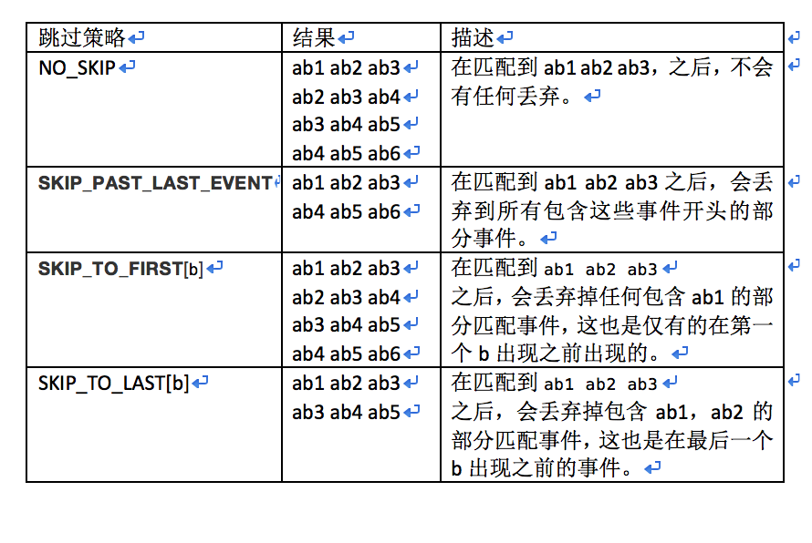
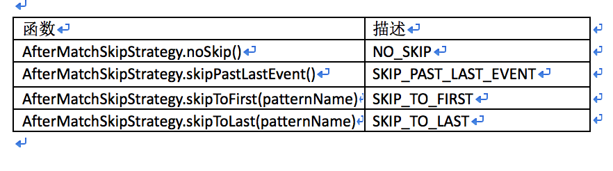

# Flink CEP
## 0. 本文概述简介

FlinkCEP是在Flink之上实现的复杂事件处理（CEP）库。 它允许你在无界的事件流中检测事件模式，让你有机会掌握数据中重要的事项。

本文描述了Flink CEP中可用的API调用。 首先介绍Pattern API，它允许你指定要在流中检测的模式，然后介绍如何检测匹配事件序列并对其进行操作。 
然后，我们将介绍CEP库在处理事件时间延迟时所做的假设。

## 1.入门

首先是要在你的pom.xml文件中，引入CEP库。
```java
<dependency>
  <groupId>org.apache.flink</groupId>
  <artifactId>flink-cep_2.11</artifactId>
  <version>1.5.0</version>
</dependency>
```
注意要应用模式匹配的DataStream中的事件必须实现正确的equals（）和hashCode（）方法，因为FlinkCEP使用它们来比较和匹配事件。

第一个demo如下：
```java
DataStream<Event> input = ...

Pattern<Event, ?> pattern = Pattern.<Event>begin("start").where(
        new SimpleCondition<Event>() {
            @Override
            public boolean filter(Event event) {
                return event.getId() == 42;
            }
        }
    ).next("middle").subtype(SubEvent.class).where(
        new SimpleCondition<Event>() {
            @Override
            public boolean filter(SubEvent subEvent) {
                return subEvent.getVolume() >= 10.0;
            }
        }
    ).followedBy("end").where(
         new SimpleCondition<Event>() {
            @Override
            public boolean filter(Event event) {
                return event.getName().equals("end");
            }
         }
    );

PatternStream<Event> patternStream = CEP.pattern(input, pattern);

DataStream<Alert> result = patternStream.select(
    new PatternSelectFunction<Event, Alert> {
        @Override
        public Alert select(Map<String, List<Event>> pattern) throws Exception {
            return createAlertFrom(pattern);
        }
    }
});
```

## 2.Pattern API

Pattern API允许你定义要从输入流中提取的复杂模式序列。

每个复杂模式序列都是由多个简单模式组成，即寻找具有相同属性的单个事件的模式。我们可以先定义一些简单的模式，然后组合成复杂的模式序列。
可以将模式序列视为此类模式的结构图，基于用户指定的条件从一个模式转换到下一个模式，例如， event.getName().equals("start")。
匹配是一系列输入事件，通过一系列有效的模式转换访问复杂模式图中的所有模式。

注意每个模式必须具有唯一的名称，以便后续可以使用该名称来标识匹配的事件。

注意模式名称不能包含字符“：”。

在本节接下来的部分，我们将首先介绍如何定义单个模式，然后如何将各个模式组合到复杂模式中。

### 2.1 单个模式
Pattern可以是单单个，也可以是循环模式。单个模式接受单个事件，而循环模式可以接受多个事件。在模式匹配符号中，模式“a b + c？d”（或“a”，后跟一个或多个“b”，可选地后跟“c”，后跟“d”），a，c ？，和d是单例模式，而b +是循环模式。
默认情况下，模式是单个模式，您可以使用Quantifiers将其转换为循环模式。每个模式可以有一个或多个条件，基于它接受事件。

#### 2.1.1 Quantifiers

在FlinkCEP中，您可以使用以下方法指定循环模式：pattern.oneOrMore（），用于期望一个或多个事件发生的模式（例如之前提到的b +）;和pattern.times（#ofTimes），
用于期望给定类型事件的特定出现次数的模式，例如4个;和patterntimes（#fromTimes，＃toTimes），用于期望给定类型事件的最小出现次数和最大出现次数的模式，例如， 2-4。

您可以使用pattern.greedy（）方法使循环模式变得贪婪，但是还不能使组模式变得贪婪。您可以使用pattern.optional（）方法使得所有模式，循环与否，变为可选。

对于名为start的模式，以下是有效的Quantifiers：

```java
 // expecting 4 occurrences
 start.times(4);

 // expecting 0 or 4 occurrences
 start.times(4).optional();

 // expecting 2, 3 or 4 occurrences
 start.times(2, 4);

 // expecting 2, 3 or 4 occurrences and repeating as many as possible
 start.times(2, 4).greedy();

 // expecting 0, 2, 3 or 4 occurrences
 start.times(2, 4).optional();

 // expecting 0, 2, 3 or 4 occurrences and repeating as many as possible
 start.times(2, 4).optional().greedy();

 // expecting 1 or more occurrences
 start.oneOrMore();

 // expecting 1 or more occurrences and repeating as many as possible
 start.oneOrMore().greedy();

 // expecting 0 or more occurrences
 start.oneOrMore().optional();

 // expecting 0 or more occurrences and repeating as many as possible
 start.oneOrMore().optional().greedy();

 // expecting 2 or more occurrences
 start.timesOrMore(2);

 // expecting 2 or more occurrences and repeating as many as possible
 start.timesOrMore(2).greedy();

 // expecting 0, 2 or more occurrences and repeating as many as possible
 start.timesOrMore(2).optional().greedy();
 
```

#### 2.1.2 Conditions-条件

在每个模式中，从一个模式转到下一个模式，可以指定其他条件。您可以将使用下面这些条件：

1. 传入事件的属性，例如其值应大于5，或大于先前接受的事件的平均值。

2. 匹配事件的连续性，例如检测模式a，b，c，序列中间不能有任何非匹配事件。

#### 2.1.3 Conditions on Properties-关于属性的条件

可以通过pattern.where（），pattern.or（）或pattern.until（）方法指定事件属性的条件。 条件可以是IterativeConditions或SimpleConditions。


1. 迭代条件：

这是最常见的条件类型。 你可以指定一个条件，该条件基于先前接受的事件的属性或其子集的统计信息来接受后续事件。

下面代码说的是：如果名称以“foo”开头同时如果该模式的先前接受的事件的价格总和加上当前事件的价格不超过该值 5.0，则迭代条件接受名为“middle”的模式的下一个事件，。 
迭代条件可以很强大的，尤其是与循环模式相结合，例如， oneOrMore()。

````java
middle.oneOrMore().where(new IterativeCondition<SubEvent>() {
    @Override
    public boolean filter(SubEvent value, Context<SubEvent> ctx) throws Exception {
        if (!value.getName().startsWith("foo")) {
            return false;
        }

        double sum = value.getPrice();
        for (Event event : ctx.getEventsForPattern("middle")) {
            sum += event.getPrice();
        }
        return Double.compare(sum, 5.0) < 0;
    }
});
````

注意对context.getEventsForPattern（...）的调用,将为给定潜在匹配项查找所有先前接受的事件。 此操作的代价可能会变化巨大，因此在使用条件时，请尽量减少其使用。

2. 简单条件：

这种类型的条件扩展了前面提到的IterativeCondition类，并且仅根据事件本身的属性决定是否接受事件。

```java
start.where(new SimpleCondition<Event>() {
    @Override
    public boolean filter(Event value) {
        return value.getName().startsWith("foo");
    }
});
```

最后，还可以通过pattern.subtype（subClass）方法将接受事件的类型限制为初始事件类型的子类型。

```java
start.subtype(SubEvent.class).where(new SimpleCondition<SubEvent>() {
    @Override
    public boolean filter(SubEvent value) {
        return ... // some condition
    }
});
```

3. 组合条件：

如上所示，可以将子类型条件与其他条件组合使用。 这适用于所有条件。 您可以通过顺序调用where（）来任意组合条件。
最终结果将是各个条件的结果的逻辑AND。 要使用OR组合条件，可以使用or（）方法，如下所示。

```java
pattern.where(new SimpleCondition<Event>() {
    @Override
    public boolean filter(Event value) {
        return ... // some condition
    }
}).or(new SimpleCondition<Event>() {
    @Override
    public boolean filter(Event value) {
        return ... // or condition
    }
});
```

4. 停止条件：

在循环模式（oneOrMore()和oneOrMore().optional()）的情况下，还可以指定停止条件，例如： 接受值大于5的事件，直到值的总和小于50。

为了更好的理解，可以看看下面的例子：

给定模式：(a+ until b)，b之前，要出现一个或者多个a。

给定输入序列：a1，c，a2，b，a3

输出结果: {a1 a2}{a1}{a2}{a3}

可以看到{a1,a2,a3},{a2,a3}这两个并没有输出，这就是停止条件的作用。

5. 连续事件条件

FlinkCEP支持事件之间以下形式进行连续：

* 严格连续性：希望所有匹配事件一个接一个地出现，中间没有任何不匹配的事件。

* 宽松连续性：忽略匹配的事件之间出现的不匹配事件。 不能忽略两个事件之间的匹配事件。

* 非确定性轻松连续性：进一步放宽连续性，允许忽略某些匹配事件的其他匹配。

为了解释上面的内容，我们举个例子。假如有个模式序列"a+ b"，输入序列"a1,c,a2,b"，不同连续条件下有不同的区别：

1. 严格连续性：{a2 b} - 由于c的存在导致a1被废弃

2. 宽松连续性：{a1,b}和{a1 a2 b} - c被忽略

3. 非确定性宽松连续性：{a1 b}, {a2 b}, 和 {a1 a2 b}

对于循环模式（例如oneOrMore()和times()），默认是宽松的连续性。 如果你想要严格的连续性，你必须使用consecutive()显式指定它，
如果你想要非确定性的松弛连续性，你可以使用allowCombinations()方法。


注意在本节中，我们讨论的是单个循环模式中的连续性，并且需要在该上下文中理解consecutive()和allowCombinations()。
稍后在讲解组合模式时，我们将讨论其他方法，例如next（）和followedBy（），用于指定模式之间的连续条件。

#### 2.1.4 API简介

1. where(condition)

定义当前模式的条件。 为了匹配模式，事件必须满足条件。 多个连续的where()，其条件为AND：
```java
pattern.where(new IterativeCondition<Event>() {
    @Override
    public boolean filter(Event value, Context ctx) throws Exception {
        return ... // some condition
    }
});
```

2. or(condition)

添加与现有条件进行OR运算的新条件。 只有在至少通过其中一个条件时，事件才能匹配该模式：

```java
pattern.where(new IterativeCondition<Event>() {
    @Override
    public boolean filter(Event value, Context ctx) throws Exception {
        return ... // some condition
    }
}).or(new IterativeCondition<Event>() {
    @Override
    public boolean filter(Event value, Context ctx) throws Exception {
        return ... // alternative condition
    }
});
```

3. until(condition)

指定循环模式的停止条件。 意味着如果匹配给定条件的事件发生，则不再接受该模式中的事件。

仅适用于oneOrMore（）

注意：它允许在基于事件的条件下清除相应模式的状态。

```java
pattern.oneOrMore().until(new IterativeCondition<Event>() {
    @Override
    public boolean filter(Event value, Context ctx) throws Exception {
        return ... // alternative condition
    }
});
```

4. subtype(subClass)

定义当前模式的子类型条件。 如果事件属于此子类型，则事件只能匹配该模式：

```java
pattern.subtype(SubEvent.class);
```

5. oneOrMore()

指定此模式至少发生一次匹配事件。

默认情况下，使用宽松的内部连续性。

注意：建议使用until（）或within（）来启用状态清除

```java
pattern.oneOrMore().until(new IterativeCondition<Event>() {
    @Override
    public boolean filter(Event value, Context ctx) throws Exception {
        return ... // alternative condition
    }
});
```

6. timesOrMore(#times)

指定此模式至少需要#times次出现匹配事件。

默认情况下，使用宽松的内部连续性（在后续事件之间）。 

```java
pattern.timesOrMore(2);
```

7. times(#ofTimes)

指定此模式需要匹配事件的确切出现次数。

默认情况下，使用宽松的内部连续性（在后续事件之间）。

```java
pattern.times(2);
```

8. times(#fromTimes, #toTimes)

指定此模式期望在匹配事件的#fromTimes次和#toTimes次之间出现。

默认情况下，使用宽松的内部连续性。

```java
pattern.times(2, 4);
```

9. optional()

指定此模式是可选的，即有可能根本不会发生。 这适用于所有上述量词。

```java
pattern.oneOrMore().optional();
```

10. greedy()

指定此模式是贪婪的，即它将尽可能多地重复。 这仅适用于quantifiers，目前不支持组模式。

```java
pattern.oneOrMore().greedy();
```

11. consecutive()

与oneOrMore（）和times（）一起使用并在匹配事件之间强加严格的连续性，即任何不匹配的元素都会中断匹配。

如果不使用，则使用宽松的连续性（如followBy（））。

例如，这样的模式：

```java
Pattern.<Event>begin("start").where(new SimpleCondition<Event>() {
  @Override
  public boolean filter(Event value) throws Exception {
    return value.getName().equals("c");
  }
})
.followedBy("middle").where(new SimpleCondition<Event>() {
  @Override
  public boolean filter(Event value) throws Exception {
    return value.getName().equals("a");
  }
}).oneOrMore().consecutive()
.followedBy("end1").where(new SimpleCondition<Event>() {
  @Override
  public boolean filter(Event value) throws Exception {
    return value.getName().equals("b");
  }
});

```

针对上面的模式，我们假如输入序列如：C D A1 A2 A3 D A4 B

使用consecutive：{C A1 B}, {C A1 A2 B}, {C A1 A2 A3 B}

不使用:{C A1 B}, {C A1 A2 B}, {C A1 A2 A3 B}, {C A1 A2 A3 A4 B}

12. allowCombinations()

与oneOrMore（）和times（）一起使用，并在匹配事件之间强加非确定性宽松连续性（如 followedByAny()）。

如果不应用，则使用宽松的连续性（如followBy()）。

例如,这样的模式：

```java
Pattern.<Event>begin("start").where(new SimpleCondition<Event>() {
  @Override
  public boolean filter(Event value) throws Exception {
    return value.getName().equals("c");
  }
})
.followedBy("middle").where(new SimpleCondition<Event>() {
  @Override
  public boolean filter(Event value) throws Exception {
    return value.getName().equals("a");
  }
}).oneOrMore().allowCombinations()
.followedBy("end1").where(new SimpleCondition<Event>() {
  @Override
  public boolean filter(Event value) throws Exception {
    return value.getName().equals("b");
  }
});
```

针对上面的模式，我们假如输入序列如：C D A1 A2 A3 D A4 B

使用allowCombinations：{C A1 B}, {C A1 A2 B}, {C A1 A3 B}, {C A1 A4 B}, {C A1 A2 A3 B}, {C A1 A2 A4 B}, {C A1 A3 A4 B}, {C A1 A2 A3 A4 B}

不使用:{C A1 B}, {C A1 A2 B}, {C A1 A2 A3 B}, {C A1 A2 A3 A4 B}


### 2.2 组合模式

#### 2.2.1 简介

已经了解了单个模式的样子，现在是时候看看如何将它们组合成一个完整的模式序列。

模式序列必须以初始模式开始，如下所示：

```java
Pattern<Event, ?> start = Pattern.<Event>begin("start");
```

接下来，您可以通过指定它们之间所需的连续条件，为模式序列添加更多模式。 在上一节中，我们描述了Flink支持的不同邻接模式，即严格，宽松和非确定性宽松，以及如何在循环模式中应用它们。
要在连续模式之间应用它们，可以使用：

>next() 对应 严格,
followedBy() 对应 宽松连续性 
followedByAny() 对应 非确定性宽松连续性

亦或

>notNext() 如果不希望一个事件类型紧接着另一个类型出现。
notFollowedBy() 不希望两个事件之间任何地方出现该事件。

>注意 模式序列不能以notFollowedBy（）结束。

>注意 NOT模式前面不能有可选模式。

```java
// strict contiguity
Pattern<Event, ?> strict = start.next("middle").where(...);

// relaxed contiguity
Pattern<Event, ?> relaxed = start.followedBy("middle").where(...);

// non-deterministic relaxed contiguity
Pattern<Event, ?> nonDetermin = start.followedByAny("middle").where(...);

// NOT pattern with strict contiguity
Pattern<Event, ?> strictNot = start.notNext("not").where(...);

// NOT pattern with relaxed contiguity
Pattern<Event, ?> relaxedNot = start.notFollowedBy("not").where(...);
```
宽松连续性指的是仅第一个成功匹配的事件会被匹配到，然而非确定性宽松连续性，相同的开始会有多个匹配结果发出。距离，如果一个模式是"a b"，给定输入序列是"a c b1 b2"。对于不同连续性会有不同输出。


1. a和b之间严格连续性，将会返回{},也即是没有匹配。因为c的出现导致a，抛弃了。

2. a和b之间宽松连续性，返回的是{a，b1},因为宽松连续性将会抛弃为匹配成功的元素，直至匹配到下一个要匹配的事件。

3. a和b之间非确定性宽松连续性，返回的是{a,b1},{a,b2}。

也可以为模式定义时间约束。 例如，可以通过pattern.within（）方法定义模式应在10秒内发生。 时间模式支持处理和事件时间。
注意模式序列只能有一个时间约束。 如果在不同的单独模式上定义了多个这样的约束，则应用最小的约束。

```java
next.within(Time.seconds(10));
```

可以为begin，followBy，followByAny和next定义一个模式序列作为条件。模式序列将被逻辑地视为匹配条件，而且将返回GroupPattern并且
可对GroupPattern使用oneOrMore（），times（#ofTimes），times（＃fromTimes，＃toTimes），optional（），consecutive（）， allowCombinations（）等方法。

```java

PatternPatte <Event, ?> start = Pattern.begin(
    Pattern.<Event>begin("start").where(...).followedBy("start_middle").where(...)
);

// strict contiguity
Pattern<Event, ?> strict = start.next(
    Pattern.<Event>begin("next_start").where(...).followedBy("next_middle").where(...)
).times(3);

// relaxed contiguity
Pattern<Event, ?> relaxed = start.followedBy(
    Pattern.<Event>begin("followedby_start").where(...).followedBy("followedby_middle").where(...)
).oneOrMore();

// non-deterministic relaxed contiguity
Pattern<Event, ?> nonDetermin = start.followedByAny(
    Pattern.<Event>begin("followedbyany_start").where(...).followedBy("followedbyany_middle").where(...)
).optional();
```

#### 2.2.2 API

1. begin(#name)

定义一个开始模式
```java
Pattern<Event, ?> start = Pattern.<Event>begin("start");
```

2. begin(#pattern_sequence)

定义一个开始模式
```java
Pattern<Event, ?> start = Pattern.<Event>begin(
    Pattern.<Event>begin("start").where(...).followedBy("middle").where(...)
);
```

3. next(#name)

追加一个新的模式。匹配事件必须直接跟着先前的匹配事件（严格连续性）：
```java
Pattern<Event, ?> next = start.next("middle");
```

4. next(#pattern_sequence)

追加一个新的模式。匹配事件必须直接接着先前的匹配事件（严格连续性）：
```java
Pattern<Event, ?> next = start.next(
    Pattern.<Event>begin("start").where(...).followedBy("middle").where(...)
);
```

5. followedBy(#name)

追加加新模式。 匹配事件和先前匹配事件（宽松连续）之间可能发生其他非匹配事件：
```java
Pattern<Event, ?> followedBy = start.followedBy("middle");
```

6. followedBy(#pattern_sequence)

追加新模式。 匹配事件和先前匹配事件（宽松连续）之间可能发生其他非匹配事件：
```java
Pattern<Event, ?> followedBy = start.followedBy(
    Pattern.<Event>begin("start").where(...).followedBy("middle").where(...)
);
```

7. followedByAny(#name)

添加新模式。 匹配事件和先前匹配事件之间可能发生其他事件，并且将针对每个备选匹配事件（非确定性放松连续性）呈现替代匹配：
```java
Pattern<Event, ?> followedByAny = start.followedByAny("middle");
```

8. followedByAny(#pattern_sequence)

添加新模式。 匹配事件和先前匹配事件之间可能发生其他事件，并且将针对每个备选匹配事件（非确定性放松连续性）呈现替代匹配：
```java
Pattern<Event, ?> followedByAny = start.followedByAny(
    Pattern.<Event>begin("start").where(...).followedBy("middle").where(...)
);
```

9. notNext()

添加新的否定模式。 匹配（否定）事件必须直接跟着先前的匹配事件（严格连续性）才能丢弃部分匹配：
```java
Pattern<Event, ?> notNext = start.notNext("not");
```

10. notFollowedBy()

追加一个新的否定模式匹配。即使在匹配（否定）事件和先前匹配事件（宽松连续性）之间发生其他事件，也将丢弃部分匹配事件序列：
```java
Pattern<Event, ?> notFollowedBy = start.notFollowedBy("not");
```

11. within(time)

定义事件序列进行模式匹配的最大时间间隔。 如果未完成的事件序列超过此时间，则将其丢弃：
```java
pattern.within(Time.seconds(10));
```

### 2.3 匹配后的跳过策略

对于给定模式，可以将同一事件分配给多个成功匹配。 要控制将分配事件的匹配数，需要指定名为AfterMatchSkipStrategy的跳过策略。
跳过策略有四种类型，如下所示：

* NO_SKIP：将发出每个可能的匹配。

* SKIP_PAST_LAST_EVENT：丢弃包含匹配事件的每个部分匹配。

* SKIP_TO_FIRST：丢弃包含PatternName第一个之前匹配事件的每个部分匹配。

* SKIP_TO_LAST：丢弃包含PatternName最后一个匹配事件之前的每个部分匹配。

请注意，使用SKIP_TO_FIRST和SKIP_TO_LAST跳过策略时，还应指定有效的PatternName。

例如，对于给定模式a b {2}和数据流ab1，ab2，ab3，ab4，ab5，ab6，这四种跳过策略之间的差异如下：



要指定要使用的跳过策略，只需调用以下命令创建AfterMatchSkipStrategy：



使用方法：

```java
AfterMatchSkipStrategy skipStrategy = ...
Pattern.begin("patternName", skipStrategy);
```

### 2.4 检测模式-Detecting Patterns

指定要查找的模式序列后，就可以将其应用于输入流以检测潜在匹配。 要针对模式序列运行事件流，必须创建PatternStream。
给定输入流 input，模式 pattern 和可选的比较器 comparator，用于在EventTime的情况下对具有相同时间戳的事件进行排序或在同一时刻到达，通过调用以下命令创建PatternStream：

```java
DataStream<Event> input = ...
Pattern<Event, ?> pattern = ...
EventComparator<Event> comparator = ... // optional

PatternStream<Event> patternStream = CEP.pattern(input, pattern, comparator);
```

根据实际情况，创建的流可以是有key，也可以是无key的。

请注意，在无key的流上使用模式，将导致job的并行度为1。

### 2.5 Selecting from Patterns

获得PatternStream后，您可以通过select或flatSelect方法从检测到的事件序列中进行查询。

select（）方法需要PatternSelectFunction的实现。 PatternSelectFunction具有为每个匹配事件序列调用的select方法。 
它以Map <String，List <IN >>的形式接收匹配，其中key是模式序列中每个模式的名称，值是该模式的所有已接受事件的列表（IN是输入元素的类型）。 
给定模式的事件按时间戳排序。 返回每个模式的接受事件列表的原因是当使用循环模式（例如oneToMany（）和times（））时，对于给定模式可以接受多个事件。 
选择函数只返回一个结果。

```java
class MyPatternSelectFunction<IN, OUT> implements PatternSelectFunction<IN, OUT> {
    @Override
    public OUT select(Map<String, List<IN>> pattern) {
        IN startEvent = pattern.get("start").get(0);
        IN endEvent = pattern.get("end").get(0);
        return new OUT(startEvent, endEvent);
    }
}
```
PatternFlatSelectFunction类似于PatternSelectFunction，唯一的区别是它可以返回任意数量的结果。 为此，select方法有一个额外的Collector参数，用于将输出元素向下游转发。

```java
class MyPatternFlatSelectFunction<IN, OUT> implements PatternFlatSelectFunction<IN, OUT> {
    @Override
    public void flatSelect(Map<String, List<IN>> pattern, Collector<OUT> collector) {
        IN startEvent = pattern.get("start").get(0);
        IN endEvent = pattern.get("end").get(0);

        for (int i = 0; i < startEvent.getValue(); i++ ) {
            collector.collect(new OUT(startEvent, endEvent));
        }
    }
}
```

### 2.6 处理超时部分模式

每当模式具有通过within关键字附加的时间窗口长度时，部分事件序列可能因为超出时间窗口长度而被丢弃。 为了对这些超时的部分匹配作出相应的处理，select和flatSelect API调用允许指定超时处理程序。
为每个超时的部分事件序列调用此超时处理程序。 超时处理程序接收到目前为止由模式匹配的所有事件，以及检测到超时时的时间戳。

为了处理部分模式，select和flatSelect API提供了一个带参数的重载版本

* PatternTimeoutFunction/ PatternFlatTimeoutFunction。
* OutputTag 超时的匹配将会在其中返回。
* PatternSelectFunction / PatternFlatSelectFunction。

```java

PatternStreamPatte <Event> patternStream = CEP.pattern(input, pattern);

OutputTag<String> outputTag = new OutputTag<String>("side-output"){};

SingleOutputStreamOperator<ComplexEvent> result = patternStream.select(
    new PatternTimeoutFunction<Event, TimeoutEvent>() {...},
    outputTag,
    new PatternSelectFunction<Event, ComplexEvent>() {...}
);

DataStream<TimeoutEvent> timeoutResult = result.getSideOutput(outputTag);

SingleOutputStreamOperator<ComplexEvent> flatResult = patternStream.flatSelect(
    new PatternFlatTimeoutFunction<Event, TimeoutEvent>() {...},
    outputTag,
    new PatternFlatSelectFunction<Event, ComplexEvent>() {...}
);

DataStream<TimeoutEvent> timeoutFlatResult = flatResult.getSideOutput(outputTag);
```

### 2.7 事件事件模式下处理滞后数据

在CEP中，元素处理的顺序很重要。为了保证在采用事件事件时以正确的顺序处理事件，最初将传入的事件放入缓冲区，其中事件基于它们的时间戳以升序排序，
并且当watermark到达时，处理该缓冲区中时间戳小于watermark时间的所有元素。这意味着watermark之间的事件按事件时间顺序处理。

请注意，在采用事件时间时，CEP library会假设watermark是正确的。

为了保证跨watermark的记录按照事件事件顺序处理，Flink的CEP库假定watermark是正确的，并将时间戳小于上次可见watermark的时间视为滞后事件。滞后事件不会被进一步处理。

### 2.8 栗子

以下示例检测事件的带key数据流上的模式start，middle（name =“error”） - > end（name =“critical”）。 事件的key是其id，并且有效模式必须在10秒内发生。 整个处理是用事件时间完成的。

```java
StreamExecutionEnvironment env = ...
env.setStreamTimeCharacteristic(TimeCharacteristic.EventTime);

DataStream<Event> input = ...

DataStream<Event> partitionedInput = input.keyBy(new KeySelector<Event, Integer>() {
	@Override
	public Integer getKey(Event value) throws Exception {
		return value.getId();
	}
});

Pattern<Event, ?> pattern = Pattern.<Event>begin("start")
	.next("middle").where(new SimpleCondition<Event>() {
		@Override
		public boolean filter(Event value) throws Exception {
			return value.getName().equals("error");
		}
	}).followedBy("end").where(new SimpleCondition<Event>() {
		@Override
		public boolean filter(Event value) throws Exception {
			return value.getName().equals("critical");
		}
	}).within(Time.seconds(10));

PatternStream<Event> patternStream = CEP.pattern(partitionedInput, pattern);

DataStream<Alert> alerts = patternStream.select(new PatternSelectFunction<Event, Alert>() {
	@Override
	public Alert select(Map<String, List<Event>> pattern) throws Exception {
		return createAlert(pattern);
	}
});
```
