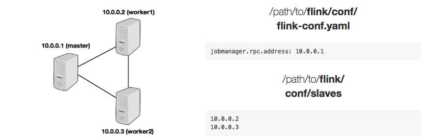

## 1. Standalone

### 1.1 环境要求
1. 软件要求
Flink运行与所有的类unix环境，例如，Linux，Mac osx和Cygwin，同时希望集群有一个master节点和一个或多个warker节点组成。在安装配置集群之前，请先确认
下面的软件已经安装配置。
* Java 1.8.x 或者更高版本
* ssh(必须运行sshd才能使用管理远程组件的Flink脚本)

如果你的集群不满足上面软件要求，就需要安装或者升级。

在所有群集节点上使用无密码SSH和相同的目录结构将允许您使用我们的脚本来控制所有内容。

2. JAVA_HOME

Flink要求在主节点和所有工作节点上设置JAVA_HOME环境变量，并指向Java安装的目录。

可以通过env.java.home键在conf/flink-conf.yaml中设置此变量。

### 1.2 Flink安装

首先根据你现有的hadoop集群下载[下载flink](https://flink.apache.org/downloads.html)

1. 配置flink

下载解压之后，就需要在 conf/flink-conf.yaml配置集群。

将jobmanager.rpc.address设置为指向master节点。 还应该通过设置jobmanager.heap.mb和taskmanager.heap.mb来定义允许JVM在每个节点上分配的最大主内存量。
这些值以MB为单位。 如果某些工作节点具有要分配给Flink系统的更多主内存，则可以通过在这些特定节点上设置环境变量FLINK_TM_HEAP来覆盖默认值。

最后，必须提供集群中所有节点的列表，这些节点将用作工作节点。 因此，与HDFS配置类似，编辑文件conf/slaves并输入每个工作节点的IP/host。 每个工作节点稍后将运行TaskManager。

以下示例说明了具有三个节点（IP地址从10.0.0.1到10.0.0.3以及主机名master，worker1，worker2）的设置，并显示了配置文件的内容（需要在所有计算机上的相同路径上访问））：



Flink目录必须在同一路径下的每个worker上都可用。 您可以使用共享NFS目录，也可以将整个Flink目录复制到每个工作节点。

[更多配置项](https://ci.apache.org/projects/flink/flink-docs-release-1.5/ops/config.html)

特别注意，下面列出几个非常重要的配置项。

* 每个JobManager的可用内存量（jobmanager.heap.mb），
* 每个TaskManager的可用内存量（taskmanager.heap.mb），
* 每台机器的可用CPU数量（taskmanager.numberOfTaskSlots），
* 集群中的CPU总数（parallelism.default），
* 临时目录（taskmanager.tmp.dirs）。

### 1.3 启动Flink

以下脚本在本地节点上启动JobManager，并通过SSH连接到从属文件中列出的所有工作节点，以在每个节点上启动TaskManager。

假如，你在master节点，并且在Flink的目录下，可以执行：

```
bin/start-cluster.sh
```

运行`stop-cluster.sh`脚本，可以停止Flink集群。

### 1.4 添加新的实例

可以使用bin/jobmanager.sh和bin/taskmanager.sh脚本将JobManager和TaskManager实例添加到正在运行的集群中。

添加JobManager
```
bin/jobmanager.sh ((start|start-foreground) cluster)|stop|stop-all
```

添加TaskManager
```
bin/taskmanager.sh start|start-foreground|stop|stop-all
```

牢记，这些命令是需要在要添加到集群中的新机器上执行的。

## 2. yarn 

