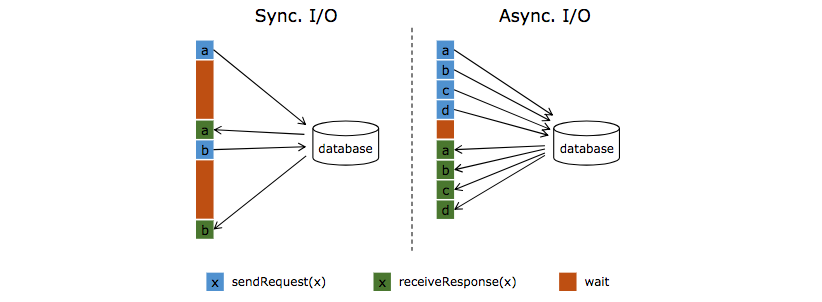

本节介绍flink的外部数据存储的异步I/O的API相关使用内容。 

注：有关异步I/O实用程序的设计和实现的详细信息，请参阅提议和设计文档FLIP-12：异步I / O设计和实现。
https://cwiki.apache.org/confluence/pages/viewpage.action?pageId=65870673

## 需要异步I / O操作

当与外部系统交互时（例如，当使用存储在数据库中的数据来丰富流事件时），需要注意与外部系统的通信延迟不会影响流应用程序的整体工作。

直接访问外部数据库中的数据，例如在MapFunction中，通常意味着同步交互：向数据库发送请求，并且MapFunction等待直到收到响应。 
在许多情况下，这种等待占据了函数的绝大部分时间。

与数据库的异步交互意味着单个并行函数实例可以同时处理许多请求并同时接收响应。 这样，可以通过发送其他请求和接收响应来覆盖等待时间。 
至少，等待时间在多个请求上均摊。 这会使得大多数情况下流量吞吐量更高。



注意：通过将MapFunction扩展到非常高的并行度来提高吞吐量在某些情况下也是可能的，
但通常需要非常高的资源成本：拥有更多并行MapFunction实例意味着更多的任务，线程，Flink内部网络连接，数据库链接，缓冲区和通用内部bookkeeping开销。


## 先决条件

如上一节所示，对数据库（或key/value存储）实现适当的异步I/O需要客户端访问支持异步请求的数据库。 许多流行的数据库提供这样的客户端

在没有这样的客户端的情况下，可以通过创建多个客户端并使用线程池处理同步调用来尝试将同步客户端转变为有限的并发客户端。 但是，这种方法通常比适当的异步客户端效率低。

## 异步I / O API

Flink的Async I/O API允许用户将异步请求客户端与数据流一起使用。 API处理与数据流的集成，以及处理顺序，事件时间，容错等。

假设有一个目标数据库的异步客户端，则需要三个部分来实现对数据库的异步I/O流转换：

* 调度请求的AsyncFunction的实现

* 一个回调，它接受操作的结果并将其交给ResultFuture

* 在DataStream上应用异步I/O操作作为转换

以下代码示例说明了基本模式：

```java

// This example implements the asynchronous request and callback with Futures that have the
// interface of Java 8's futures (which is the same one followed by Flink's Future)

/**
 * An implementation of the 'AsyncFunction' that sends requests and sets the callback.
 */
class AsyncDatabaseRequest extends RichAsyncFunction<String, Tuple2<String, String>> {

    /** The database specific client that can issue concurrent requests with callbacks */
    private transient DatabaseClient client;

    @Override
    public void open(Configuration parameters) throws Exception {
        client = new DatabaseClient(host, post, credentials);
    }

    @Override
    public void close() throws Exception {
        client.close();
    }

    @Override
    public void asyncInvoke(String key, final ResultFuture<Tuple2<String, String>> resultFuture) throws Exception {

        // issue the asynchronous request, receive a future for result
        final Future<String> result = client.query(key);

        // set the callback to be executed once the request by the client is complete
        // the callback simply forwards the result to the result future
        CompletableFuture.supplyAsync(new Supplier<String>() {

            @Override
            public String get() {
                try {
                    return result.get();
                } catch (InterruptedException | ExecutionException e) {
                    // Normally handled explicitly.
                    return null;
                }
            }
        }).thenAccept( (String dbResult) -> {
            resultFuture.complete(Collections.singleton(new Tuple2<>(key, dbResult)));
        });
    }
}

// create the original stream
DataStream<String> stream = ...;

// apply the async I/O transformation
DataStream<Tuple2<String, String>> resultStream =
    AsyncDataStream.unorderedWait(stream, new AsyncDatabaseRequest(), 1000, TimeUnit.MILLISECONDS, 100);

```

重要说明：ResultFuture在第一次调用ResultFuture.complete时完成。 随后的所有完整调用都将被忽略。

以下两个参数控制异步操作：

* 超时：超时定义异步请求在被视为失败之前可能需要多长时间。 此参数可防止dead/failed的请求。

* 容量：此参数定义可能同时有多少异步请求正在进行中。 尽管异步I/O方法通常会带来更好的吞吐量，但操作算子仍然可能成为流应用程序的瓶颈。 
限制并发请求的数量可确保操作算子不会累积不断增加的待处理请求积压，但一旦容量耗尽就会触发反压。

## 超时处理

当异步I/O请求超时时，默认情况下会引发异常并重新启动作业。如果要处理超时，可以覆盖AsyncFunction＃timeout方法。

## 结果的顺序

AsyncFunction发出的并发请求经常以某种未定义的顺序完成，具体取决于首先完成的请求。为了控制发出结果记录的顺序，Flink提供了两种模式：

* Unordered：异步请求完成后立即发出结果记录。在异步I/O运算符之后，流中记录的顺序与之前不同。当使用处理时间作为基本时间特性时，此模式具有最低延迟和最低开销。
对此模式使用AsyncDataStream.unorderedWait（...）。

* Ordered：在这种情况下，保留流顺序。结果记录的发出顺序与触发异步请求的顺序相同（运算符输入记录的顺序）。
为此，操作算子缓冲结果记录，直到其所有先前记录被发出（或超时）。这通常会在检查点中引入一些额外的延迟和一些开销，因为与无序模式相比，记录或结果在检查点状态下保持更长的时间。
对此模式使用AsyncDataStream.orderedWait（...）。

## 事件时间

当流应用程序与事件时间一起工作时，异步I / O操作符将正确处理watermark。这意味着两种顺序模式具体如下：

* Unordered：watermark不会超过记录，反之亦然，这意味着watermark建立了一个顺序边界。记录仅在watermark之间无序发出。
只有在发出watermark后才会发出某个watermark后发生的记录。反过来，只有在输入的所有结果记录发出之后才会发出watermark。

这意味着在存在watermark的情况下，无序模式会引入一些与有序模式相同的延迟和管理开销。开销量取决于watermark频率。

* Ordered：保留记录的watermark顺序，就像保留记录之间的顺序一样。与处理时间相比，开销没有显着变化。

请记住，注入时间是事件时间的一种特殊情况，其中自动生成的watermark基于源处理时间。

## 容错保证

异步I/O运算符提供完全一次的容错保证。它将检查点中的传输中异步请求的记录存储起来，并在从故障中恢复时恢复/重新触发请求。

## 实现技巧

对于有一个Executor（或scala的执行上下文-ExecutionContext）Future回调的实现，建议使用一个DirectExecutor，因为回调通常做最少的工作，此外DirectExecutor避免了额外的线程到线程切换的开销。
回调通常只将结果传递给ResultFuture，后者将其添加到输出缓冲区。从那里开始，包括记录发射和与检查点簿记交互的重要逻辑无论如何都发生在专用线程池中。

DirectExecutor可以通过org.apache.flink.runtime.concurrent.Executors.directExecutor（）或com.google.common.util.concurrent.MoreExecutors.directExecutor（）获得。

## 警告
AsyncFunction不能叫做多线程

想在这里明确指出的常见混淆是AsyncFunction不是以多线程方式调用的。只存在一个AsyncFunction实例，并且为流的相应分区中的每个记录顺序调用它。
除非asyncInvoke（...）方法返回快速并依赖于回调（由客户端），否则它将不会导致正确的异步I/O.

例如，以下模式导致阻塞asyncInvoke（...）函数，从而使异步行为无效：

* 使用lookup/query方法调用数据库客户端会阻塞直到收到结果为止

* 阻塞/等待异步客户端在asyncInvoke（...）方法中返回的future-type对象
