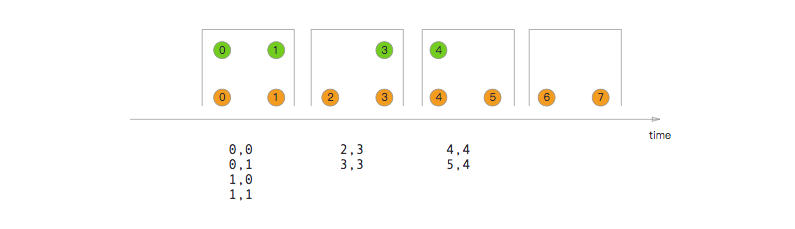
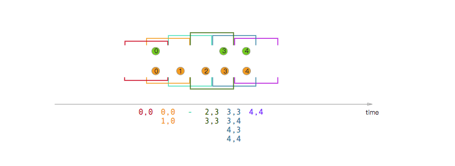
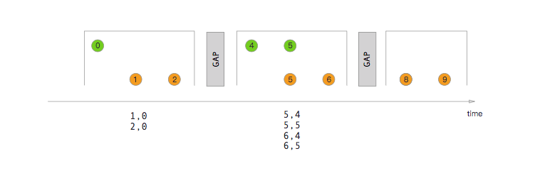
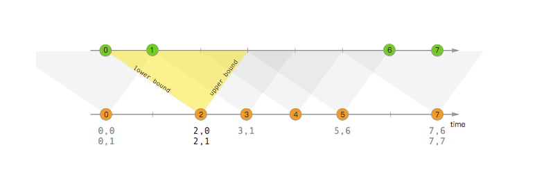

## window join

窗口join 是对同一窗口相同key的元素进行join。来子两个流的元素传递给用户自定义JoinFunction 或者 FlatJoinFunction ，然后由其发出join的结果。


基本使用概括如下：
```java
stream.join(otherStream)
    .where(<KeySelector>)
    .equalTo(<KeySelector>)
    .window(<WindowAssigner>)
    .apply(<JoinFunction>)
```

关于语义的一些提示：

* 窗口join表现很想innerjoin，只有一方存在的key不会作为结果发出。

* 那些join的元素将在其时间戳中包含仍位于相应窗口中的最大时间戳。 例如，以[5,10]作为其边界的窗口将导致join的元素使用9作为其时间戳。
  在下一节中，我们将使用一些示例性场景概述不同类型的窗口连接的行为。


## tumbling window join

tumbling window join翻译成滚动窗口。

执行滚动窗口连接时，对具有相同key和相同滚动窗口的所有元素进行成对组合，并将结果传递给JoinFunction或FlatJoinFunction。
因为它的行为类似于内连接，所以不会发出只在一个流存在的元素！



如图所示，我们定义了一个大小为2毫秒的翻滚窗口，这形成形式为[0,1]，[2,3]，......的窗口。图中显示了在每个窗口中的所有元素成对组合，最终将传递给JoinFunction。 
注意，在翻滚窗口[6,7]中没有发出任何东西，因为在绿色流中没有元素存在来与橙色元素⑥和⑦join。

```java
import org.apache.flink.api.java.functions.KeySelector;
import org.apache.flink.streaming.api.windowing.assigners.TumblingEventTimeWindows;
import org.apache.flink.streaming.api.windowing.time.Time;
 
...

DataStream<Integer> orangeStream = ...
DataStream<Integer> greenStream = ...

orangeStream.join(greenStream)
    .where(<KeySelector>)
    .equalTo(<KeySelector>)
    .window(TumblingEventTimeWindows.of(Time.seconds(2)))
    .apply (new JoinFunction<Integer, Integer, String> (){
        @Override
        public String join(Integer first, Integer second) {
            return first + "," + second;
        }
    });
```


## sliding window join

sliding window join翻译成滑动窗口join。

执行滑动窗口时，所有具有相同key和存在于相同滑动窗口的元素将会被成对组合，然后传递给JoinFunction 或者 FlatJoinFunction。
在当前滑动窗口中，假如一个流存在某个元素而另一个流不存在，将不会发出该元素。请注意，某些元素可能在一个滑动窗口中join而在另一个滑动窗口中不join。



在这个例子中，我们使用大小为2毫秒的滑动窗口并将每毫秒滑动一次，从而产生滑动窗口[-1,0]，[0,1]，[1,2]，[2,3] ，...... x轴下方的连接元素是传递给每个滑动窗口的JoinFunction的元素。
在这里你还可以看到例如橙色②如何与窗口[2,3]中的绿色③join，但是没有与窗口[1,2]中的任何东西join。

```java
import org.apache.flink.api.java.functions.KeySelector;
import org.apache.flink.streaming.api.windowing.assigners.SlidingEventTimeWindows;
import org.apache.flink.streaming.api.windowing.time.Time;


DataStream<Integer> orangeStream = ...
DataStream<Integer> greenStream = ...

orangeStream.join(greenStream)
    .where(<KeySelector>)
    .equalTo(<KeySelector>)
    .window(SlidingEventTimeWindows.of(Time.milliseconds(2) /* size */, Time.milliseconds(1) /* slide */))
    .apply (new JoinFunction<Integer, Integer, String> (){
        @Override
        public String join(Integer first, Integer second) {
            return first + "," + second;
        }
    });
```
## session window join

session window join可以翻译成会话窗口join。

当执行会话窗口join时，具有相同key的所有元素在“组合”满足会话条件时以成对组合方式join并传递给JoinFunction或FlatJoinFunction。
由于执行内连接，因此如果有一个会话窗口只包含来自一个流的元素，则不会发出任何输出！



这里我们定义一个会话窗口join，其中每个会话由至少1ms的间隙分割。 有三个会话，在前两个会话中，两个流的连接元素都传递给JoinFunction。 在第三阶段，绿色流中没有元素，所以⑧和⑨没有连接！

```java
import org.apache.flink.api.java.functions.KeySelector;
import org.apache.flink.streaming.api.windowing.assigners.EventTimeSessionWindows;
import org.apache.flink.streaming.api.windowing.time.Time;
 
...

DataStream<Integer> orangeStream = ...
DataStream<Integer> greenStream = ...

orangeStream.join(greenStream)
    .where(<KeySelector>)
    .equalTo(<KeySelector>)
    .window(EventTimeSessionWindows.withGap(Time.milliseconds(1)))
    .apply (new JoinFunction<Integer, Integer, String> (){
        @Override
        public String join(Integer first, Integer second) {
            return first + "," + second;
        }
    });
```

## interval join

interval join翻译成区间join

区间join使用公共key join两个流的元素（我们现在将它们称为A和B），并且流B的元素具有的时间戳位于流A中元素的时间戳的相对时间间隔中。

这也可以更正式地表达为b.timestamp∈[a.timestamp + lowerBound; a.timestamp + upperBound]或a.timestamp + lowerBound <= b.timestamp <= a.timestamp + upperBound

其中a和b是共享相同key的A和B的元素。 只要下限总是小于或等于上限，下限和上限都可以是负数或正数。 区间join当前仅执行内连接。

当一对元素传递给ProcessJoinFunction时，将为它们分配两个元素的较大的时间戳（可以通过ProcessJoinFunction.Context访问）。

注意区间join当前仅支持事件时间。




在上面的例子中，我们连接两个流'orange'和'green'，下限为-2毫秒，上限为+1毫秒。 
默认情况下，这些边界是包括在内的，但可以应用.lowerBoundExclusive（）和.upperBoundExclusive来更改行为。

再次使用更正式的表示法，这将转化为

orangeElem.ts + lowerBound <= greenElem.ts <= orangeElem.ts + upperBound

如三角形所示。

```java
import org.apache.flink.api.java.functions.KeySelector;
import org.apache.flink.streaming.api.functions.co.ProcessJoinFunction;
import org.apache.flink.streaming.api.windowing.time.Time;

...

DataStream<Integer> orangeStream = ...
DataStream<Integer> greenStream = ...

orangeStream
    .keyBy(<KeySelector>)
    .intervalJoin(greenStream.keyBy(<KeySelector>))
    .between(Time.milliseconds(-2), Time.milliseconds(1))
    .process (new ProcessJoinFunction<Integer, Integer, String(){

        @Override
        public void processElement(Integer left, Integer right, Context ctx, Collector<String> out) {
            out.collect(first + "," + second);
        }
    });
```