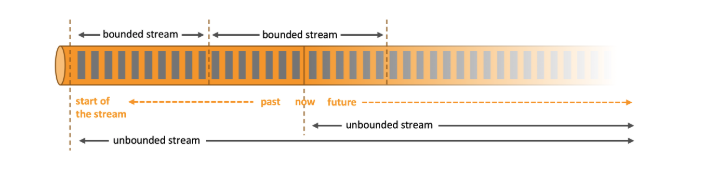

# 1. Architecture

flink是一个架构和分布式处理引擎，设计目的是有状态的处理有界流和无界流。flink可以运行与所有通用的集群管理器，以内存的速度进行计算并且支持任何规模部署。

下面，我们解释一下Flink架构的重要方面。

## 1.1 处理无界数据和有界数据

任何种类的数据都是以事件流的形式产生。信用卡交易，传感器测量，机器日志或网站或移动应用程序上的用户交互，所有这些数据都作为流生成。

数据可以作为有界流和无界流被处理。
1. 无界流意思很明显，只有开始没有结束。必须连续的处理无界流数据，也即是在事件注入之后立即要对其进行处理。不能等待数据到达了再去全部处理，因为数据是无界的并且永远不会结束数据注入。
处理无界流数据往往要求事件注入的时候有一定的顺序性，例如可以以事件产生的顺序注入，这样会使得处理结果完整。

2. 有界流，也即是有明确的开始和结束的定义。有界流可以等待数据全部注入完成了再开始处理。注入的顺序不是必须的了，因为对于一个静态的数据集，我们是可以对其进行排序的。有界流的处理也可以称为批处理。



flink擅长处理有界流和无界流数据集。精确的事件和状态控制可以使得flink可以运行任何针对无界流处理的应用。有界流数据通过为固定数据集特殊设计的算子和数据结构的处理，也表现出很好的性能。

## 1.2 可以部署与任何地方

Flink是分布式系统，为了处理应用程序需要计算资源。Flink可以整合所有通用的集群资源管理器，比如yarn，mesos，kubernetes，同时也可以单独运行。

当部署flink应用的时候，flink会根据应用程序配置的并行度自动识别需要的资源并且向资源管理器申请相应的资源。如过发生故障，Flink会通过申请新的容器来替换掉失败的容器。无论是提交app或者是控制app进行的通讯都是经过rest调用的形式进行的。这使得flink可以很轻松的整合到很多环境。


## 1.3 运行任意规模的应用

Flink可以运行任意规模的流式应用程序。应用会并发成数以千计的task，这些task在集群中分布式并行运行。因此，应用程序可以利用几乎无限量的CPU，主内存，磁盘和网络IO。
另外，flink可以保存非常大规模的应用状态。

其异步和增量检查点算法确保对处理延迟的影响最小，同时保证恰一次的状态一致性。

## 1.4 利用内存性能

有状态Flink应用程序针对本地状态访问进行了优化。任务状态始终保留在内存中，或者，如果状态大小超过可用内存，则保存在访问高效的磁盘上。

因此，任务通过访问本地（通常是内存中）状态来执行所有计算，从而产生非常低的处理延迟。 Flink通过定期和异步checkpoint本地状态到持久存储来保证在出现故障时的恰一次的状态一致性。

状态访问和存储的过程如下图：


# 2. application

## 2.1 flink应用组成block

Apache Flink是一个用于对无界和有界数据流进行有状态计算的框架。 Flink提供在不同抽象级别的API，并为常见用例提供专用库。

在这里，我们介绍Flink易于使用和富有表现力的API和库。

可以用流处理框架构建和执行的应用程序的类型由框架控制流，状态和时间的成度来决定。下文中，我们会对流程序的组成部分进行介绍，并讲解flink处理他们的方法。

### 2.1.1 Streams

显然，流是流处理的根本。但是，流可以具有不同的特征，这些特征会影响流的处理方式。Flink是一个多功能的处理框架，可以处理任何类型的流。

   * 有界和无界流：流可以是无界的，也可以是有界的。Flink具有处理无界流的复杂功能，但也有专门的操作算子来有效地处理有界流。
   
   * 实时处理和离线处理: 所有的数据都是按照流的形式产生。有两种处理数据的方式，也即是实时处理和缓存下来在进行离线处理。
   
### 2.1.2 state

很多流都是由状态的，当然也有些流仅仅是单独的处理事件，这些流是无状态的。运行基本业务逻辑的任何应用程序都需要记住事件或中间结果，以便在以后的时间点访问它们，例如在收到下一个事件时或在特定持续时间之后。


应用的状态是flink的一等公民。您可以通过观察Flink在状态处理环境中提供的所有功能来查看。

* Multiple State Primitives(多状态原语):
    
    Flink为不同的数据结构提供状态原语，例如atomic values, lists, or maps. 开发人员可以根据函数的访问模式选择最有效的状态原语。

* Pluggable State Backends(可插拔状态后端):
    
    应用程序状态由可插拔状态后端管理和checkpoint。 Flink具有不同的状态后端，可以在内存或RocksDB中存储状态，RocksDB是一种高效的嵌入式磁盘数据存储。 也可以插入自定义状态后端。

* Exactly-once state consistency(恰一次状态一致性): 
    
    flink的checkpoint和recovery算法保证了应用状态在失败的情况下的一致性。因此，故障是透明处理的，不会影响应用程序的正确性。

* Very Large State(非常大的状态):

     由于其异步和增量检查点算法，Flink能够维持几TB的应用程序状态。

* Scalable Applications(可扩展的应用程序)：

    Flink通过将状态重新分配给更多或更少的工作人员来支持有状态应用程序的扩展。


### 2.1.3 Time

事件是流程序的另一个重要组成部分。大多数事件流都具有固有的时间语义，因为每个事件都是在特定时间点生成的。此外，许多常见的流计算基于时间，例如窗口聚合，会话化(sessionization)，模式检测(pattern detection)和基于时间的join。

Flink提供了一组丰富的与时间相关的特征。

* 事件时间模式：
    
    使用事件时间语义处理流的应用程序根据事件的时间戳计算结果。因此，无论是否处理记录的或实时的事件，事件时间处理都允许准确和一致的结果。

* 支持watermark：
    
    Flink使用watermark来推断基于事件时间的应用中的时间。watermark也是一种灵活的机制，可以权衡结果的延迟和完整性。
    
* 延迟数据处理：

当使用watermark在事件时间模式下处理流时，可能会发生在所有相关事件到达之前已完成计算。这类事件被称为迟发事件。 Flink具有多种处理延迟事件的选项，例如通过侧输出重新路由它们以及更新以前完成的结果。

* 处理时间模式：

除了事件时间模式之外，Flink还支持处理时间语义，该处理时间语义执行由处理机器的系统时间触发计算。处理时间模式适用于具有严格的低延迟要求的某些应用，这些要求可以容忍近似结果。

## 2.2 分层API

Flink提供三层API。 每个API在简洁性和表达性之间提供不同的权衡，并针对不同的用例。


我们简要介绍每个API，讨论它的应用程序，并展示一个代码示例。
### 2.2.1 ProcessFunctions

ProcessFunctions是Flink提供的最具表现力的功能接口。 Flink提供ProcessFunctions来处理来自窗口中分组的单个事件 亦或者一个或两个输入流的单个事件。
ProcessFunctions提供对时间和状态的细粒度控制。 ProcessFunction可以任意修改其状态并注册将在未来触发回调函数的定时器。 
因此，ProcessFunctions可以实现许多有状态事件驱动应用程序所需的复杂的单事件业务逻辑。

以下示例显示了一个KeyedProcessFunction，它对KeyedStream进行操作并匹配START和END事件。 收到START事件时，该函数会记住其状态的时间戳，并内注册一个在四小时内的计时器。
如果在计时器触发之前收到END事件，则该函数计算END和START事件之间的持续时间，清除状态并返回该值。 否则，计时器只会触发并清除状态。
```java
/**
 * Matches keyed START and END events and computes the difference between 
 * both elements' timestamps. The first String field is the key attribute, 
 * the second String attribute marks START and END events.
 */
public static class StartEndDuration
    extends KeyedProcessFunction<String, Tuple2<String, String>, Tuple2<String, Long>> {

  private ValueState<Long> startTime;

  @Override
  public void open(Configuration conf) {
    // obtain state handle
    startTime = getRuntimeContext()
      .getState(new ValueStateDescriptor<Long>("startTime", Long.class));
  }

  /** Called for each processed event. */
  @Override
  public void processElement(
      Tuple2<String, String> in,
      Context ctx,
      Collector<Tuple2<String, Long>> out) throws Exception {

    switch (in.f1) {
      case "START":
        // set the start time if we receive a start event.
        startTime.update(ctx.timestamp());
        // register a timer in four hours from the start event.
        ctx.timerService()
          .registerEventTimeTimer(ctx.timestamp() + 4 * 60 * 60 * 1000);
        break;
      case "END":
        // emit the duration between start and end event
        Long sTime = startTime.value();
        if (sTime != null) {
          out.collect(Tuple2.of(in.f0, ctx.timestamp() - sTime));
          // clear the state
          startTime.clear();
        }
      default:
        // do nothing
    }
  }

  /** Called when a timer fires. */
  @Override
  public void onTimer(
      long timestamp,
      OnTimerContext ctx,
      Collector<Tuple2<String, Long>> out) {

    // Timeout interval exceeded. Cleaning up the state.
    startTime.clear();
  }
}
```
该示例说明了KeyedProcessFunction的表达能力，但也强调了它是一个相当冗长的接口。

### 2.2.2 The DataStream API

DataStream API为许多常见的流处理操作提供原语，例如窗口化，一次记录转换以及通过查询外部数据存储来丰富事件。
DataStream API可用于Java和Scala，它基于函数编程，例如map()，reduce()和aggregate()。 可以通过扩展接口或 作为Java或Scala lambda函数来定义函数。

以下示例显示如何对点击流进行会话并计算每个会话的点击次数。

```java
// a stream of website clicks
DataStream<Click> clicks = ...

DataStream<Tuple2<String, Long>> result = clicks
  // project clicks to userId and add a 1 for counting
  .map(
    // define function by implementing the MapFunction interface.
    new MapFunction<Click, Tuple2<String, Long>>() {
      @Override
      public Tuple2<String, Long> map(Click click) {
        return Tuple2.of(click.userId, 1L);
      }
    })
  // key by userId (field 0)
  .keyBy(0)
  // define session window with 30 minute gap
  .window(EventTimeSessionWindows.withGap(Time.minutes(30L)))
  // count clicks per session. Define function as lambda function.
  .reduce((a, b) -> Tuple2.of(a.f0, a.f1 + b.f1));
SQL & Table API
```

### 2.2.3 SQL & Table API

Flink有两个关系API，Table API和SQL。 两个API都是用于批处理和流处理的统一API，即，在无界的实时流或有界的记录流上以相同的语义执行查询，并产生相同的结果。
Table API和SQL利用Apache Calcite进行解析，验证和查询优化。 它们可以与DataStream和DataSet API无缝集成，并支持用户定义的标量，聚合和表值函数。

Flink的关系API旨在简化数据分析，数据pipeline和ETL应用程序的定义。

以下示例显示了用于对点击流进行会话并计算每个会话的点击次数的SQL查询。 这与DataStream API示例中的用例相同。

```sql
SELECT userId, COUNT(*)
FROM clicks
GROUP BY SESSION(clicktime, INTERVAL '30' MINUTE), userId
```

## 3. Libraries

Flink具有几个用于常见数据处理用例的库。这些库通常嵌入在API中，而不是完全独立的。因此，他们可以从API的所有功能中受益，并与其他库集成。

* 复杂事件处理（CEP）：

    模式检测是事件流处理的一个非常常见的用例。 Flink的CEP库提供了一个API来指定事件模式（想想正则表达式或状态机）。 
    CEP库与Flink的DataStream API集成，以便在DataStream上评估模式。 CEP库的应用包括网络入侵检测，业务流程监控和欺诈检测。

* DataSet API：

    DataSet API是Flink用于批处理应用程序的核心API。 DataSet API的原语包括map，reduce，（outer）join，co-group和iterate。
    所有操作均由算法和数据结构支持，这些算法和数据结构对内存中的序列化数据进行操作，并在数据大小超过内存预算时溢出到磁盘。
    Flink的DataSet API的数据处理算法受到传统数据库运算符的启发，例如混合散列 hash-join 或外部合并排序。

* Gelly：

    Gelly是一个可扩展的图形处理和分析库。 Gelly是在DataSet API之上实现的，并与DataSet API集成在一起。因此，它受益于其可扩展且强大的操作算子。 
    Gelly具有内置算法，如标签传播，三角枚举和页面排名，但也提供了一个简化自定义图算法实现的Graph API。


# 3. operations

Apache Flink是一个用于对无界和有界数据流进行有状态计算的框架。由于许多流应用程序设计为以最短的停机时间连续运行，因此流处理器必须提供出色的故障恢复，以及在应用程序运行时监视和维护应用程序的工具。


Apache Flink非常关注流处理的操作方面。 在这里，我们将解释Flink的故障恢复机制，并介绍其管理和监督正在运行的应用程序的功能。

## 3.1 7*24小时运行

机器和过程故障在分布式系统中无处不在。 像Flink这样的分布式流处理器必须从故障中恢复，以便能够24/7全天候运行流应用程序。 显然，这不仅意味着在故障后重新启动应用程序，而且还要确保其内部状态保持一致，以便应用程序可以继续处理，就像从未发生过故障一样。

Flink提供了多种功能，以确保应用程序报纸运行并保持一致：

* 一致的Checkpoint

    Flink的恢复机制基于应用程序状态的一致检查点。如果发生故障，将重新启动应用程序并从最新检查点加载其状态。结合可重置流源，此功能可以保证一次性状态一致性。
高效的检查点：如果应用程序保持TB级的状态，则检查应用程序的状态可能非常昂贵。 Flink可以执行异步和增量检查点，以便将检查点对应用程序的延迟SLA的影响保持在非常小的水平。
    
* 端到端地恰一次：

    Flink为特定存储系统提供事务接收器，保证数据只写出一次，即使出现故障。
    
* 与集群管理器集成：

    Flink与集群管理器紧密集成，例如Hadoop YARN，Mesos或Kubernetes。当进程失败时，将自动启动一个新进程来接管其工作。
    
* 高可用性设置：

    Flink具有高可用性模式，可消除所有单点故障。 HA模式基于Apache ZooKeeper，这是一种经过验证的可靠分布式协调服务。

## 3.2 更新，迁移，暂停和恢复您的应用程序

需要维护为关键业务服务提供支持的流应用程序。 需要修复错误，并且需要改进或实现新功能。 但是，更新有状态流应用程序并非易事。
通常，人们不能简单地停止应用程序并重新启动固定版本或改进版本，因为人们无法承受丢失应用程序的状态。

Flink的Savepoints是一个独特而强大的功能，可以解决更新有状态应用程序和许多其他相关挑战的问题。 Savepoints是应用程序状态的一致快照，因此与检查点非常相似。 
但是，与检查点相比，需要手动触发Savepoints，并且在应用程序停止时不会自动删除Savepoints。 Savepoints可用于启动状态兼容的应用程序并初始化其状态。 
Savepoints可启用以下功能：

* 应用程序的演变
    
    Savepoints可用于发展应用程序。可以从从先前版本的应用程序中获取的Savepoints重新启动应用程序的固定或改进版本。也可以从较早的时间点（假设存在这样的保存点）启动应用程序，以修复由有缺陷的版本产生的错误结果。

* 群集迁移：

    使用Savepoints，可以将应用程序迁移（或克隆）到不同的群集。

* Flink版本更新：

    可以使用Savepoints迁移应用程序以在新的Flink版本上运行。

* 应用程序扩展：

    Savepoints可用于增加或减少应用程序的并行性。

* A/B测试和What-If情景：

    可以通过启动同一Savepoints的所有版本来比较两个（或更多）不同版本的应用程序的性能或质量。

* 暂停和恢复：

    可以通过获取Savepoints并停止它来暂停应用程序。在以后的任何时间点，都可以从Savepoints恢复应用程序。

* 存档：

    Savepoints可以存档，以便能够将应用程序的状态重置为较早的时间点。
    
# 4. 监控和控制您的应用程序

与任何其他服务一样，需要监视连续运行的流应用程序并将其集成到企业的运营架构（即，监视和日志记录服务）中。
监控有助于预测问题并提前做出反应。日志记录可以根本原因分析来调查故障。最后，控制运行应用程序的易于访问的界面是一个重要特性。

Flink可以与许多常见的日志系统和监视服务很好地集成，并提供REST API来控制应用程序和查询信息。

* Web UI：

    Flink具有Web UI，可以检查，监视和调试正在运行的应用程序。 它还可用于提交执行执行或取消执行。
* 日志记录：

    Flink实现了流行的slf4j日志记录界面，并与日志框架log4j或logback集成。
* 度量标准：

    Flink具有复杂的度量标准系统，用于收集和报告系统和用户定义的度量标准。 度量标准可以导出到reporter，包括JMX，Ganglia，Graphite，Prometheus，StatsD，Datadog和Slf4j。
* REST API：

    Flink暴露REST API以提交新应用程序，获取正在运行的应用程序的Savepoints或取消应用程序。 REST API还暴露元数据和收集的运行或已完成应用程序的指标。


